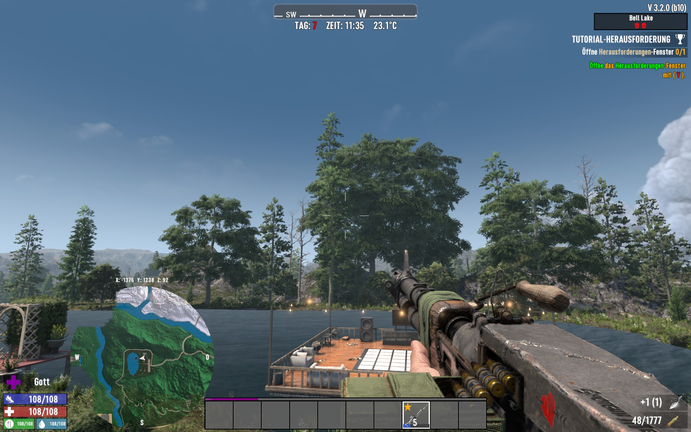
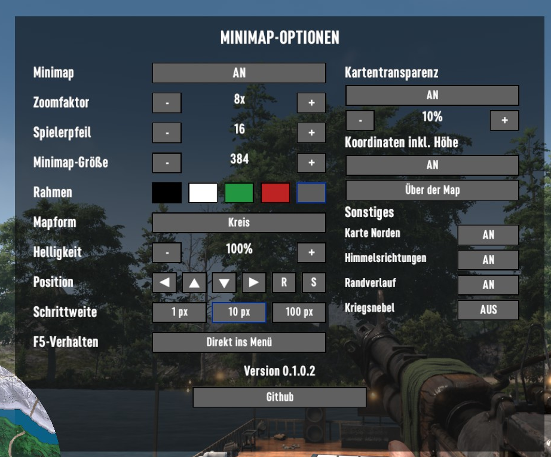

# MiniMap_Mod

Client-Mod für **7 Days to Die 3.2 und 3.3**. Mod-Autor: **NAS4Killer**.

Version: **0.2.0.0**

## Bilder

Minimap im Spiel:



Minimap-Optionen:



## Installation

**Hinweis:** Nutzung auf eigene Gefahr. Vor Installation und Updates Spielstände und Serverdaten sichern.

### Singleplayer

1. Spiel vollständig beenden.
2. ZIP beim [neuesten Release](https://github.com/NAS4Killer/MiniMap_Mod/releases/latest) herunterladen und entpacken.
3. Den enthaltenen Ordner `MiniMap_Mod` in den `Mods`-Ordner der Spielinstallation kopieren. Bei Bedarf `Mods` anlegen.
4. Direkt unter `Mods/MiniMap_Mod/` müssen `ModInfo.xml`, `MiniMap_Mod.dll` und der Unterordner `Config` liegen. Keine zusätzliche ZIP-Unterordnerebene verwenden.
5. Spiel ohne Easy Anti-Cheat starten, Spielstand laden und mit **F5** die Optionen öffnen.

### Dedicated Server

Für diese Version sind **eine Installation auf jedem Spieler-PC und die UI-Dateien auf dem Server** erforderlich. Eine Installation nur auf dem Server ersetzt die Client-Installation nicht.

#### Auf jedem Spieler-PC

1. Die vollständige Mod wie unter **Singleplayer** installieren: den gesamten Ordner `MiniMap_Mod` aus der Release-ZIP nach `<Spielinstallation>/Mods/` kopieren.
2. Das Spiel ohne Easy Anti-Cheat starten.
3. Nach der Serverinstallation und dem Serverneustart verbinden und mit **F5** die Minimap-Optionen öffnen.

#### Auf dem Server

1. Den Dedicated Server vollständig stoppen.
2. Dieselbe Release-ZIP wie auf den Spieler-PCs herunterladen und entpacken.
3. Im `Mods`-Ordner der **Serverinstallation** den Ordner `MiniMap_Mod` anlegen.
4. Aus der ZIP diese drei Dateien mit den Unterordnern übernehmen:

```text
<Serverinstallation>/Mods/MiniMap_Mod/
├── ModInfo.xml
└── Config/
    └── XUi_InGame/
        ├── windows.xml
        └── xui.xml
```

5. Auf den Server **nur `ModInfo.xml`, `windows.xml` und `xui.xml`** mit der oben gezeigten Ordnerstruktur kopieren. **`MiniMap_Mod.dll` nicht auf den Server kopieren; sie gehört auf die Spieler-PCs.**
6. Easy Anti-Cheat für den Server deaktivieren und den Dedicated Server wieder starten.

**Updates:** Auf PC und Server dieselbe Mod-Version verwenden. Der Updatebutton im Spiel aktualisiert nur die lokale Client-Installation. Die drei Serverdateien bei einem Serverupdate manuell aus derselben Release-ZIP ersetzen und den Server neu starten.

Pro Spieler-PC und Server jeweils nur eine Installation von `MiniMap_Mod` verwenden. Keine zusätzliche ZIP-Unterordnerebene oder zweite Kopie in einem anderen Mods-Ordner anlegen.

## Bedienung

MiniMap Menü aufrufen mit F5.  
Bei geöffneten Optionen schließt F5 das Menü. **ESC** schließt es ebenfalls. Änderungen werden gespeichert.

- **Minimap:** an/aus. Im Escape-Menü wird die Karte ausgeblendet.
- **Zoomfaktor:** 0, 2, 4, 6, 8 oder 10; größere Werte zoomen näher heran.
- **Spielerpfeil:** Größe 16 bis 80, unabhängig von der Kartenhelligkeit.
- **Pfeilfarbe:** Gelb, Weiß, helles Grün, Rot oder Originalfarbe der Spielkarte. Original übernimmt auch die vom Spiel zugewiesene Gruppenfarbe. Ein blauer Buttonrahmen markiert die gespeicherte Auswahl.
- **Minimap-Größe:** 128 bis 480.
- **Rahmen:** fünf direkte Farbbuttons für Schwarz, Weiß, Grün, Rot und Rahmenlos. Ein blauer Buttonrahmen markiert die Auswahl. Der Rahmenlos-Button hat einen neutral grauen Inhalt.
- **Mapform:** Kreis oder Quadrat.
- **Kriegsnebel:** an zeigt unbekannte Bereiche grau; aus macht diese vollständig transparent. Unbekanntes Gelände wird dadurch nicht aufgedeckt. Die Erkundung wird beim Chunkwechsel aktualisiert.
- **Helligkeit:** 10 bis 100 Prozent, nur für die Karte.
- **Kartentransparenz:** an/aus; 2 bis 20 Prozent in 2-Prozent-Schritten. Aus bedeutet vollständig deckend.
- **Randverlauf:** an/aus. Bei Kreis und Quadrat wird der äußere Kartenrand weich ausgeblendet, mit und ohne Kriegsnebel. Ohne Kriegsnebel bleibt zusätzlich der Verlauf am Übergang zwischen erkundetem und unbekanntem Gelände erhalten.
- **Karte Norden:** an hält Norden oben; aus dreht die Karte und hält den Spielerpfeil nach oben.
- **Koordinaten:** an/aus; eine Zeile über oder unter der Karte. X und Y zeigen die Kartenposition, Z die Höhe in Metern.
- **N–S–O–W:** an/aus; Himmelsrichtungen am Kartenrand. Bei drehender Karte folgen ihre Positionen der Kartenausrichtung.
- **Position:** vier Richtungsknöpfe mit ▲ ▼ ◄ ►; Schrittweite 1, 10 oder 100 Pixel. Ein blauer Buttonrahmen markiert die Schrittweite. **S** speichert die Position als Standard, **R** stellt diesen Standard wieder her. Beim Überfahren von R oder S erscheint ein Erklärungstext unter GitHub.
- **F5-Verhalten** ist im Menü wählbar: 
-„Direkt ins Menü“ öffnet und schließt die Optionen mit F5 (Standard). 
-„Ein/Aus + Doppel-F5“ blendet mit F5 die Minimap ein/aus und öffnet mit zweimal F5  die Optionen.
- **Version:** zeigt die installierte Mod-Version.
- **Github:** öffnet die Projektseite, wenn kein Update verfügbar ist. Beim ersten Öffnen des Menüs wird automatisch geprüft. Ein neues Release erscheint als grünes **Download + Version**, nach dem Download als grünes **Installieren + Version**.
- **Release Notes:** erscheint unter dem Updatebutton, wenn ein Update verfügbar ist, und öffnet die Releasebeschreibung genau dieser Version auf GitHub.

Die Minimap zeigt andere sichtbare Spieler, Wegpunkte und die Symbole der Originalkarte. Die Sichtbarkeitsregeln des Spiels bleiben erhalten. Marker folgen Zoom und Kartendrehung und erscheinen nur innerhalb der Minimap. Spielernamen werden nicht eingeblendet.

Unter **Sonstiges** stehen Karte Norden, Himmelsrichtungen, Randverlauf und Kriegsnebel.

## Wenn keine MiniMap erscheint

Ordnerstruktur und Spielversion 3.2 oder 3.3 prüfen.
Mit F5 kontrollieren, dass die MiniMap eingeschaltet ist. Doppelte Mod-Installationen vermeiden.

## Technischer Stand

- Beim Erkunden werden geänderte Kartenbereiche in kleinen Kacheln aktualisiert. Bei ausgeschalteter Minimap pausieren Kartenberechnung und Markeraktualisierung.
- Beim Öffnen der Optionen werden beide Kriegsnebel-Darstellungen vorbereitet. Der Button wechselt zwischen den fertigen Bildern. Beim Schließen wird die ungenutzte Darstellung freigegeben.

## Bauen

```powershell
dotnet build .\src\MiniMapMod.csproj -p:GameDir="C:\Program Files (x86)\Steam\steamapps\common\7 Days To Die"
```

Die erzeugte DLL liegt unter `src/bin/Debug/netstandard2.1/MiniMap_Mod.dll`.

## Versionierung

Das Projekt verwendet immer vier Stellen nach dem Schema `A.B.C.D`. Die Version steht im Code und im Commit-Betreff.
Bei jeder weiteren Aenderung wird mindestens die letzte Stelle `D` erhoeht.

## Zukunfts-ToDo

- Einzelne Markertypen abschaltbar machen.
- Entfernte Marker am Kartenrand anzeigen.
- Permanente zweite Minimap.
- Standalone-Minimap ohne Serverinstallation.
- Zuschaltbares Erz-Radar.

## Updates

Updates sind optional und werden ausschließlich vom Nutzer gestartet; die Mod installiert keine Updates automatisch ohne dessen Zustimmung.

Beim ersten Öffnen des Optionsmenüs wird das neueste stabile GitHub-Release abgefragt, ohne
Anmeldung und ohne Zugangsdaten. Ein neueres Release erscheint mit seiner
Versionsnummer. Gleiche oder ältere Releases werden nicht installiert.

**Download + Version** lädt das Paket herunter und prüft Größe, SHA-256-Prüfsumme,
Ordnerstruktur, enthaltene Dateien, Mod-Autor und Version. Anschließend
**Installieren + Version** anklicken. Der Button zeigt wieder **Github**,
darunter rot **Spiel neu starten**. Dann das Spiel vollständig beenden.
Ein unsichtbarer Windows-Helfer wartet auf das Spielende, sichert die bisherigen
Dateien und installiert anschließend das Update. Das Spiel wird weder beendet
noch neu gestartet. Bei Schreibfehlern versucht der Helfer, die alten Dateien
wiederherzustellen. Administratorrechte werden nicht automatisch angefordert.

Sicherungen und das Ergebnis `result.txt` liegen im jeweiligen Auftragsordner
unter `%APPDATA%/7DaysToDie/MiniMap_Updates/`. Bei einem Installationsfehler dort
nachsehen; alternativ die ZIP vom neuesten Release manuell installieren.
Die persönlichen Einstellungen in `%APPDATA%/7DaysToDie/MiniMap_Mod.cfg`
bleiben erhalten. Die automatische Installation ist für Windows vorgesehen.


